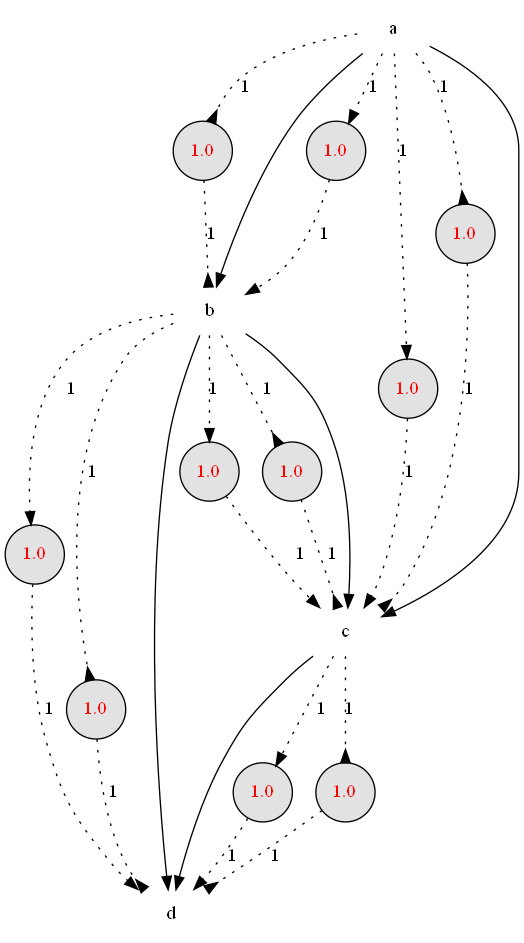

# Bayes Petri Net

This softare displays the
evolution (on a Jupyter notebook) of
* a conventional Petri Net
* a special
Petri Net that we call a "Bayes Petri Net" (BPN).

With every Bayesian Network (BN),
one can define a natural BPN that has the 
nodes of the BN as the transition nodes of the
BPN.