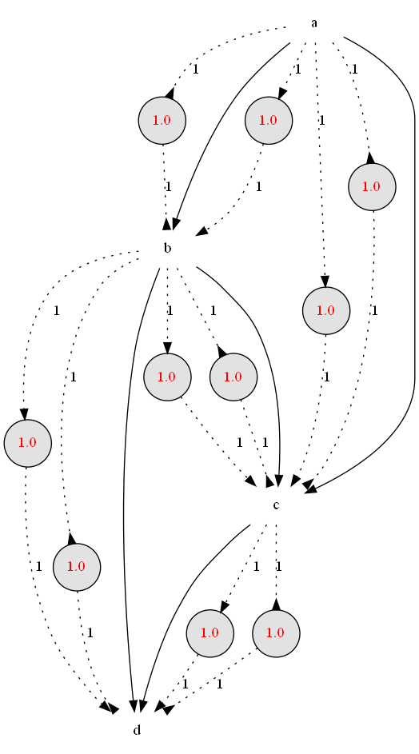

# Bayes Petri Net

*This is a figure of a typical **Bayes Petri Net**
(BPN). It was rendered 
by the software in this repo using Graphviz. The solid arrows
and uncircled nodes constitute a **Bayesian Network**
whereas the dotted arrows are the **arcs**,
the circled nodes are the **places**, and the
uncircled nodes are the **transitions** of a **Petri Net**.
The red numbers are the token contents of 
the place nodes (note that
we allow them to be fractional)*

This software displays the
evolution (on a Jupyter notebook) of
* a conventional **Petri Net**
* a special
Petri Net that we call a **Bayes Petri Net** (BPN).

With every **Bayesian Network** (BN),
one can define a natural BPN that has the 
nodes of the BN as the transition nodes of the
BPN.

The firing rules for the BPN are 
given by Pearl's rules for **d-separation**.

BPN are closely related to 
**message passing** which was used 
by Pearl in his book *Probabilistic Reasoning in Intelligent Systems: 
Networks of Plausible Inference (1988)*

## Excerpt from my book Bayesuvius

A **Petri net** (pnet) is basically a diagram of an idealized machine that features actions (called transitions) and buffers (called places) that contain resources (called tokens). This diagram evolves in time like a motion picture.  In that motion picture, transitions are fired at various times, sometimes concurrently (i.e., in parallel) and the effect of that is shown  by the motion of the tokens. The evolution of many  machines can be abstracted to a pnet. 

A pnet portrays the evolution and allocation of token resources of an idealized machine, whereas a bnet portrays the causal connections of events with each other. Two big differences between the two diagrams  are:  

* No evolution occurs in a bnet; it's as if the bnet's TPMs (transition probabilitiy matrices) had been calculated empirically, and those empirical distributions had reached a **steady state** long ago. On the other hand, evolution does occur in a pnet, so we can say that a pnet  occupies a **transient state**. 

* pnet diagrams portray a machine. They **do not necessarily portray events** as nodes (although they can, and events do occur in their motion picture). bnets, on the other hand, **do portray  events** as nodes and their causal connections.  

So if pnets and bnets are so different, why do I discuss pnets in this book. Well, it turns out one can build a pnet on top of a bnet, using the bnet nodes as the transitions of the pnet. The resulting diagram, called  a **Bayes-Petri net**, gives both transient and steady state information about causality.